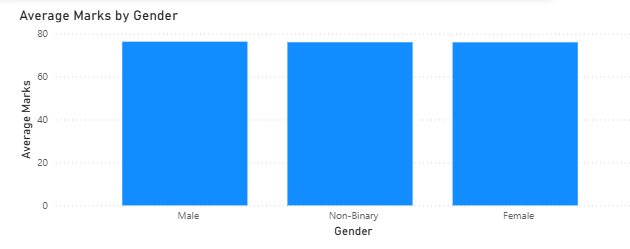
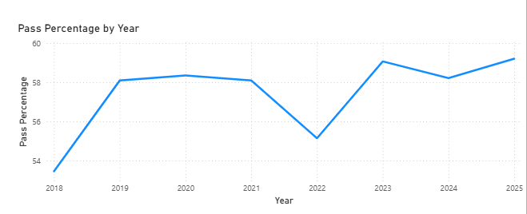

# Student Performance Analytics Dashboard 📊

## 📌 Project Overview

This is a **Power BI dashboard** built to explore and understand student performance data with interactive visuals. It highlights average marks, comparisons across genders, pass/fail distribution, and trend analysis over several years.

---

## 📁 Dataset

- Includes student scores, subject averages, gender information, pass/fail status, and year-wise results.
- Cleaned and transformed using Power Query in Power BI.
- The dataset is **embedded within the `.pbix` file**.
- Used for academic/portfolio purposes.

---

## 🛠️ Tools & Technologies

- **Power BI Desktop**
- **Power Query** (for data cleaning)
- **Data Modeling**
- **DAX** (for calculated measures, if used)
- **Interactive Visualizations**

---

## 📊 Dashboard Features

- **Summary View:** Shows overall average marks and pass percentage.
- **Subject vs Overall Average:** Compares subject averages with overall averages.
- **Average Marks by Gender:** Bar chart showing gender-based performance.
- **Pass vs Fail Distribution:** Donut chart of pass/fail counts.
- **Pass Percentage by Year:** Line chart displaying trend from 2018 to 2025.
- **Interactive Filters:** Allows filtering by available dimensions.

---

## 📈 Key Insights

- Overall pass percentage is approximately **57%**, with **43%** failing.
- Average marks are similar across genders.
- Pass percentage trend fluctuates from 2018 through 2025.
- Visual comparison helps identify higher and lower performing subjects.

---

## 🖼️ Dashboard Preview

Include screenshots for quick visual context:

```md



